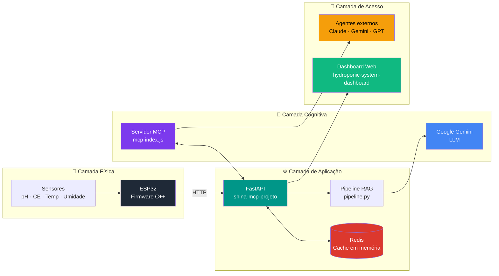

## 📖 Sobre o Projeto

**SHINA** (Sistema Hidropônico Inteligente Autônomo) é uma plataforma completa que une **IoT**, **microsserviços** e **IA generativa** para monitorar e operar sistemas hidropônicos em tempo real.

Diferente de um dashboard passivo, o SHINA é **AI-Native**: a estufa é exposta como uma **ferramenta universal** via Model Context Protocol (MCP), permitindo que qualquer agente de IA — como Claude, Gemini ou GPT — consulte sensores, leia o estado das plantas e execute ações de forma autônoma, em linguagem natural.

A IA não "adivinha" o estado do sistema: ela **lê** os dados exatos do segundo via RAG, eliminando alucinações. Isso traz para a agricultura de precisão uma camada cognitiva real, acessível e replicável.

---

## 🎓 Publicação Acadêmica

> **Artigo aceito no XVIII Simpósio Brasileiro de Computação Ubíqua e Pervasiva (SBCUP 2026).**
>
> *MACHADO TAVARES, R. et al.* **SHINA: Sistema Hidropônico Inteligente Autônomo com Arquitetura IoT e Agentes Conversacionais.** XVIII Simpósio Brasileiro de Computação Ubíqua e Pervasiva (SBCUP), 2026.

---

## 🏗️ Arquitetura



**Fluxo resumido:**

1. **ESP32** lê sensores físicos a cada N segundos e envia leituras via HTTP para o backend.
2. **FastAPI** (`shina-mcp-projeto/`) recebe, valida e armazena leituras em **Redis** (cache de baixa latência, sem SGBD relacional — a estufa é um sistema de "agora").
3. Quando uma pergunta chega, o **pipeline RAG** monta o contexto com leituras reais e consulta o **Gemini**.
4. O **servidor MCP** (`mcp-index.js`) expõe esse stack como uma ferramenta universal — qualquer agente de IA externo pode consultar e operar a estufa pelo protocolo MCP.
5. O **dashboard** consome a mesma API para visualização humana.

---

## 🧱 Stack Tecnológica

| Camada | Tecnologia | Função no SHINA |
|---|---|---|
| **IoT / Hardware** | ESP32 (C++) | Firmware embarcado que lê sensores e envia leituras |
| **Sensores** | pH, condutividade elétrica, temperatura, umidade | Leitura física do ambiente |
| **Backend / API** | Python + FastAPI | Recebe leituras, expõe endpoints REST, orquestra o pipeline |
| **Cache / Estado** | Redis | Memória de curto prazo ultrarrápida — sempre o "agora" |
| **Pipeline IA** | RAG (Retrieval-Augmented Generation) | Injeta contexto real do sistema no prompt |
| **LLM** | Google Gemini | Geração de respostas em linguagem natural |
| **Protocolo Cognitivo** | MCP (Model Context Protocol) | Expõe a estufa como ferramenta universal para agentes |
| **Servidor MCP** | Node.js (`mcp-index.js`) | Adaptador entre o protocolo MCP e a camada de aplicação |
| **Dashboard** | Web (`hydroponic-system-dashboard/`) | Visualização para operadores humanos |
| **Orquestração** | Docker Compose | Sobe todos os serviços containerizados |

---

## 📁 Estrutura do Repositório

```
shina-mcp/
├── shinaarduinofinal/              # Firmware do ESP32 (C++)
│   └── ...                         # Leitura de sensores + envio HTTP
│
├── shina-mcp-projeto/              # Backend Python (FastAPI)
│   ├── app.py                      # Aplicação principal
│   ├── api.py                      # Endpoints REST
│   ├── pipeline.py                 # Pipeline RAG (contexto + LLM)
│   ├── list_models.py              # Utilitário para listar modelos Gemini
│   ├── requirements.txt
│   ├── Dockerfile
│   └── .env.example
│
├── hydroponic-system-dashboard/    # Dashboard web (visualização humana)
│
├── mcp-index.js                    # Servidor MCP (Node.js)
├── Dockerfile.mcp                  # Imagem Docker do servidor MCP
├── Docker-compose.yml              # Orquestração dos serviços
└── README.md
```

---

## 🚀 Como Executar

### Pré-requisitos

- Docker e Docker Compose instalados
- Node.js 18+ (para o servidor MCP)
- Python 3.10+ (caso queira rodar o backend fora do container)
- Chave de API do Google Gemini ([obter aqui](https://aistudio.google.com/))
- ESP32 + sensores (para o lado físico — ver `shinaarduinofinal/`)

### 1. Clonar o repositório

```bash
git clone https://github.com/rafaelmtavares44/shina-mcp.git
cd shina-mcp
```

### 2. Configurar variáveis de ambiente

Copie `.env.example` para `.env` e preencha:

```env
GEMINI_API_KEY=sua_chave_aqui
REDIS_HOST=redis
REDIS_PORT=6379
API_PORT=8000
MCP_PORT=3000
```

### 3. Subir o stack com Docker Compose

```bash
docker compose up --build
```

Serviços disponíveis após o startup:

- API FastAPI: `http://localhost:8000`
- Servidor MCP: `http://localhost:3000`
- Redis: `localhost:6379`

### 4. Gravar o firmware no ESP32

A pasta `shinaarduinofinal/` contém o sketch a ser compilado e gravado via **Arduino IDE** ou **PlatformIO**. Ajuste o IP do servidor e as credenciais Wi-Fi no início do arquivo principal.

---

## 🤖 Usando o SHINA como ferramenta de agentes

Uma vez de pé, o servidor MCP expõe a estufa para qualquer cliente compatível com o protocolo. Configure o cliente (ex: Claude Desktop) apontando para o endpoint MCP, e o agente passa a ter acesso a operações como:

- `get_current_readings()` — leituras atuais de pH, CE, temperatura, umidade
- `get_recommendations()` — recomendações geradas pelo pipeline RAG
- `set_target_ph(value)` — define o pH-alvo do sistema
- *(demais ferramentas listadas dentro de `mcp-index.js`)*

Isso transforma o SHINA em uma **estufa programável por linguagem natural** — o agente pode responder *"Como estão minhas alfaces?"* lendo o estado real do sistema.

---

## 👥 Time :

- Rafael Machado Tavares
- José Pazian
- Bruno Matheus
- Jorge Vinícius

**Orientação acadêmica**
- Prof. Willgnner Ferreira Santos
- Prof. Alisson Rodrigues
- Prof. Ujeverson

**Instituição**
- [Faculdade SENAI Fatesg](https://www.fatesg.edu.br/) — Curso Superior de Inteligência Artificial
- Diretor: Weysller Matuzinhos de Moura

---

## 📜 Licença

Este projeto é um trabalho acadêmico desenvolvido como Projeto Integrador do 2º período do Curso Superior de Inteligência Artificial da **Faculdade SENAI Fatesg**.

Para uso, citação ou colaboração, entre em contato: **rafaelmt3@gmail.com**

---


**Se este projeto te interessou, deixe uma ⭐ no repositório!**

*Construído com ☕, curiosidade e muita hidroponia em Goiânia/GO.*

</div>
